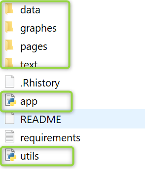
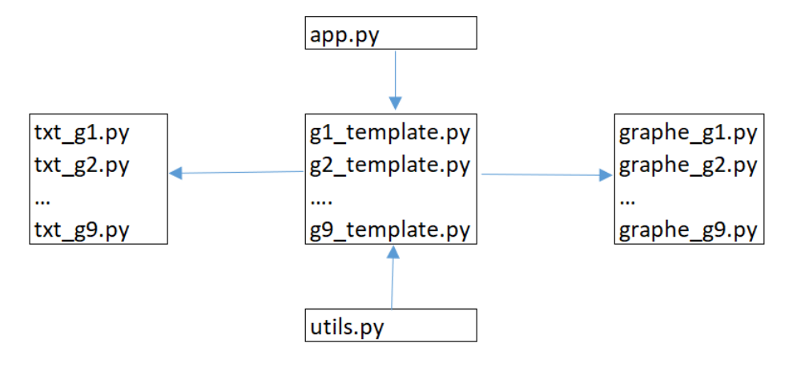
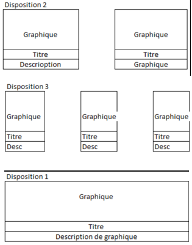
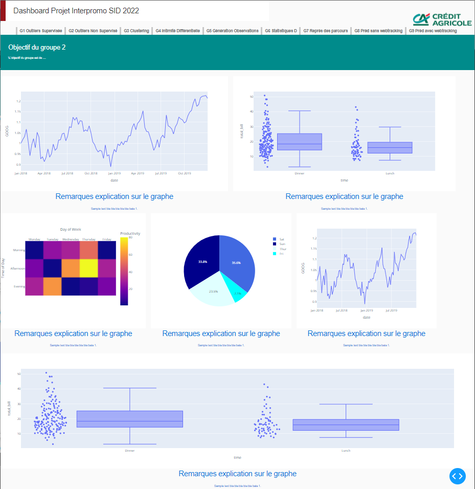
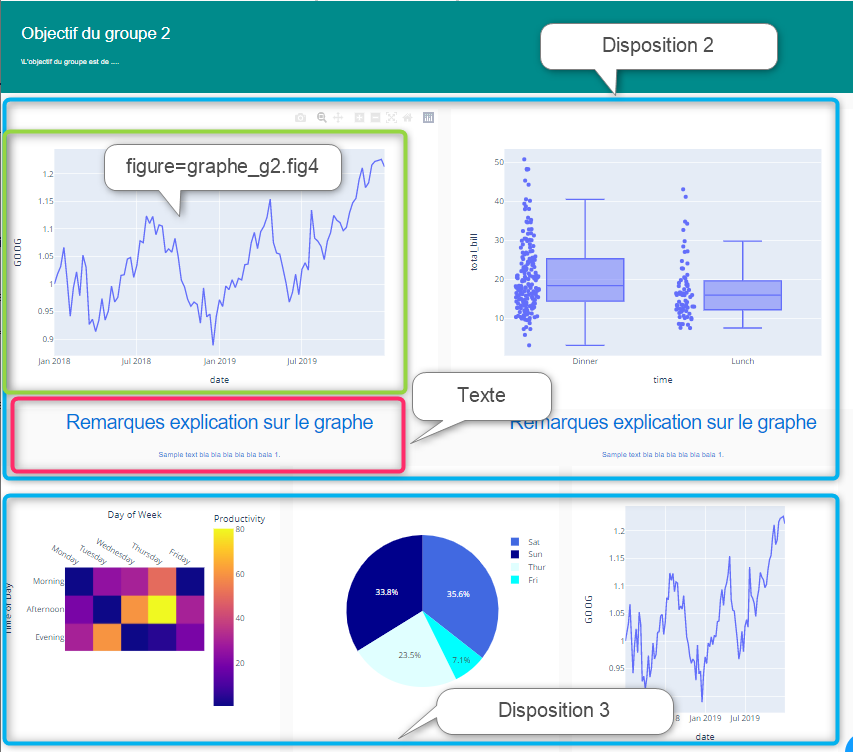

Dans ce dossier vous trouverez 2 documents la charte qualité et la charte graphique accompagné d'un manuel d'utilisation.  

# Charte qualité 
Ce document indique les conventions de codage à respecter par l'ensemble des groupes.

# Charte graphique et manuel d'utilsation 
 
La charte indique les conventions à respecter principalement au moment de création de vos graphiques sur le dashboard.

Le manuel explique l'architecture de la plateforme DASH/PLOTLY et comment s'y prendre pour intégrer vos graphiques.
## Arborescence

    

## Architecture

    

* **app.py** est le script python de lancement
* **utils.py** est le fichier de construction du header de tous les fichiers. Aucune modification n'est à faire ici.
* **graphes** est le dossier contenant les scripts python pour le développement de vos graphiques. Il y a un script par groupe.
* **text** est le dossier contenant les scripts python pour l'implémentation des élements de texte qui accompagnent vos graphiques. Il y a un script par groupe.
* **pages** est le dossier contenant les scripts python qui appellent vos graphiques et textes. Il y a un script par groupe.

## Workflow
Explicitons le workflow avec un exemple :
Pour intégrer un graphique un développeur du groupe 2 va : 
* **étape 1** : lancer l'application avec app.py
* **étape 2** : se positionner sur le script *graphe_g2.py* et implémenter le graphique de son choix.Par exemple ici un "line chart plotly" 
` df = px.data.stocks()` 
`fig4 = px.line(df, x='date', y="GOOG")`
* **étape 3** : se positionner sur le script *txt_g2.py* et implémenter les élements de texte accompagnant son graphique:  
` cont_txt_1 = dbc.Row([
    dbc.Col(dbc.Card( [dbc.CardBody( [html.H4('Remarques explication sur le graphe ', className='card-title', style=CARD_TEXT_STYLE),
                        html.P('Sample text bla bla bla bla bla bala 1.', style=CARD_TEXT_STYLE),]),]),md=12),
])` 

* **étape 4** :se positionner sur le script *g2_template.py* pour appeller le graphique et son composant texte et les intégrer au dashboard. Au moment de l'intégration de vos graphiques , vous devez choisir une des trois dispositions prédefinies.

    

Un développeur choisissant la disposition 2 va insérer son code dans l'espace prévu à cet effet : 

                       
        
                   `html.Div([ ### les 2graphes
                        html.Div([dcc.Graph(figure=graphe_g2.fig4),],className="six columns",), ## graphe fig1           
                        html.Div([dcc.Graph(figure=graphe_g2.fig3),],className="six columns",), ## graphe fig3
                        ],
                        className="row ",),
		   html.Div([
                            ### les deux cases textes.
                            html.Div([txt_g2.cont_txt_1] ,className="six columns",), 
                            html.Div([txt_g2.cont_txt_1],className="six columns",), 
                        ],
                        className="row ",),`

## Rendu 

    

## Rendu annoté

    

 
 
